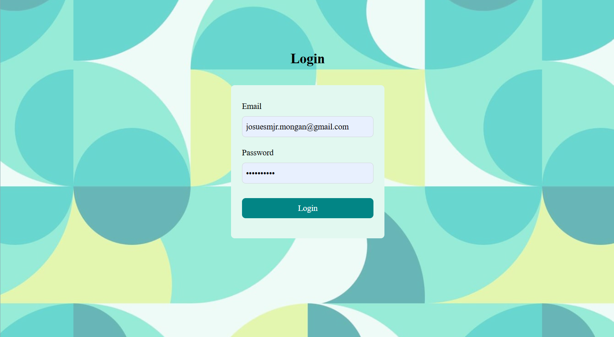
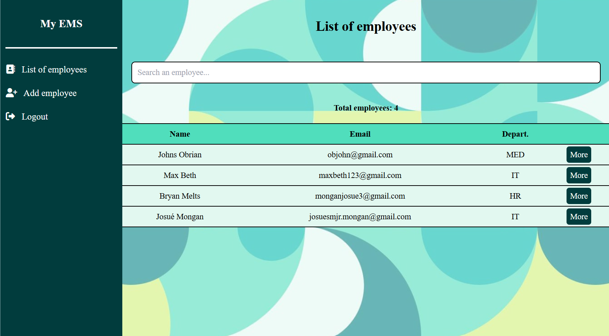

## Preview
 
 

## About the project
This is a secure employee management system done using Next.js, Typescript and MongoDB. For the style I used TailwindCSS. 

This project helps display my understanding of MVC organization and my ability to use Next.js to build beautiful and fast working web applications.

## How it works
First the admin or the user must be already registered in the database with it's email and password. When he successfully connects, he has access to an interface where he can see the list of employees, add a new employee with their info, modify an employee's info or even delete the ones that are no longer needed.

The interface is user-friendly and also responsive(it works also well on small screens). The security of the app is tight as the credentials are deleted every three hours after any login to the app.

## How to start
There are certain essentials steps you must follow after **cloning the project**, in other to be able to use the app properly.

First you need to **create a database and add an admin with an email and a password**.

Secondly, you must **fill the .env file** with the good environnement variables:
MONGO_URI=
NEXT_PUBLIC_API_URL=

Thirdly, you run **npm run dev**

## Hope you enjoy
Have fun, leave a star if you like please and any contribution or improvement is welcome.